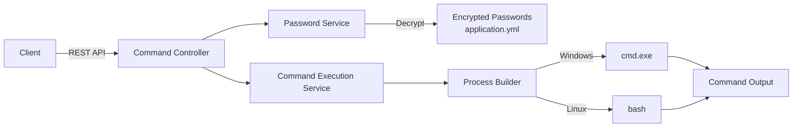

# Command Wrapper Service

A secure command execution wrapper service with password placeholder replacement. Supports both Windows and Linux platforms.

## Features

- **Password Placeholder Replacement**: Replace placeholders like `${password:db}` with encrypted passwords
- **Cross-Platform Support**: Works on Windows and Linux
- **Jasypt Encryption**: Secure password storage using Jasypt encryption
- **RESTful API**: Easy integration with other services
- **Synchronous & Asynchronous Execution**: Support for both sync and async command execution
- **Configurable Timeout**: Set execution timeout per command or use default

## Architecture



## Quick Start

### Prerequisites

- JDK 21
- Maven 3.6+

### Build

```bash
# Windows
mvn clean package -DskipTests

# Linux/Mac
./mvnw clean package -DskipTests
```

### Run

```bash
# Windows
scripts\run.bat your-encryption-password

# Linux/Mac
chmod +x scripts/run.sh
./scripts/run.sh your-encryption-password
```

Or directly with Java:

```bash
java -jar target/command-wrapper-service-1.0.0.jar \
    --jasypt.encryptor.password=your-encryption-password
```

## Configuration

### Password Placeholder Format

Configure passwords in `src/main/resources/application.yml`:

```yaml
command-wrapper:
  passwords:
    # Format: type:key = plaintext_password (will be encrypted)
    password:db = mySecretDbPassword
    password:ssh = mySshPassword
    secret:api_key = myApiKey
```

### Placeholder Syntax

Use placeholders in commands with format `${type:key}`:

```bash
# Example commands with placeholders
mysql -u root -p${password:db}
ssh user@host -p ${password:ssh}
curl -H "Authorization: Bearer ${secret:api_key}" https://api.example.com
```

### Full Configuration Example

```yaml
command-wrapper:
  placeholder:
    prefix: "${"    # Opening delimiter
    suffix: "}"     # Closing delimiter
    separator: ":" # Type/key separator
  
  passwords:
    password:db = ENC(encrypted_value_here)
    password:ssh = ENC(encrypted_value_here)
  
  default-timeout-seconds: 300
  max-concurrent-commands: 10
  working-directory: ${user.dir}
```

## API Reference

### Base URL

```
http://localhost:8080/api/v1/commands
```

### 1. Execute Command Synchronously

**POST** `/api/v1/commands/execute`

Execute a command and wait for result.

**Request:**
```json
{
    "command": "mysql -u root -p${password:db} -e 'SHOW DATABASES;'",
    "workingDirectory": "/home/user",
    "timeoutSeconds": 60
}
```

**Response:**
```json
{
    "taskId": "550e8400-e29b-41d4-a716-446655440000",
    "exitCode": 0,
    "stdout": "Database\ninformation_schema\nmysql\nperformance_schema\nsys\n",
    "stderr": "",
    "success": true,
    "startTime": 1704067200000,
    "endTime": 1704067205000,
    "executionTimeMs": 5000
}
```

### 2. Execute Command Asynchronously

**POST** `/api/v1/commands/execute-async`

Start command execution and return immediately with task ID.

**Request:**
```json
{
    "command": "long-running-script.sh",
    "timeoutSeconds": 3600
}
```

**Response:**
```json
{
    "taskId": "550e8400-e29b-41d4-a716-446655440001",
    "status": "PENDING",
    "message": "Command execution started. Use GET /api/v1/commands/550e8400.../status to check status"
}
```

### 3. Get Task Status

**GET** `/api/v1/commands/{taskId}/status`

Check the status of an async command execution.

**Response:**
```json
{
    "taskId": "550e8400-e29b-41d4-a716-446655440001",
    "status": "RUNNING",
    "startTime": 1704067200000,
    "executionTimeMs": 5000
}
```

### 4. Get Task Result

**GET** `/api/v1/commands/{taskId}/result`

Get the execution result of a completed async task.

**Response:**
```json
{
    "taskId": "550e8400-e29b-41d4-a716-446655440001",
    "exitCode": 0,
    "stdout": "Command output here",
    "stderr": "",
    "success": true,
    "startTime": 1704067200000,
    "endTime": 1704067210000,
    "executionTimeMs": 10000
}
```

### 5. Cancel Task

**DELETE** `/api/v1/commands/{taskId}`

Cancel a running async task.

**Response:**
```json
{
    "taskId": "550e8400-e29b-41d4-a716-446655440001",
    "cancelled": true,
    "message": "Task cancellation requested"
}
```

### 6. Health Check

**GET** `/api/v1/commands/health`

Check if the service is running.

**Response:**
```json
{
    "status": "UP",
    "service": "command-wrapper-service",
    "timestamp": 1704067200000
}
```

## Password Encryption

### Encryption Algorithm

The service uses **PBEWITHHMACSHA512ANDAES_256** algorithm with **RandomIvGenerator** for secure encryption.

### Generate Encrypted Password via REST API

#### Encrypt with Custom Password

**POST** `/api/v1/crypto/encrypt`

Encrypt a plaintext value using a custom encryption password.

```bash
curl -X POST "http://localhost:8080/api/v1/crypto/encrypt?plaintext=mySecretPassword&password=myEncryptionPassword"
```

**Response:**
```json
{
    "success": true,
    "encrypted": "ENC(kHd8sK3j...+encrypted+value...)"
}
```

#### Decrypt with Custom Password

**POST** `/api/v1/crypto/decrypt`

Decrypt a ciphertext using a custom decryption password.

```bash
curl -X POST "http://localhost:8080/api/v1/crypto/decrypt?ciphertext=ENC(kHd8sK3j...+encrypted+value...)&password=myEncryptionPassword"
```

**Response:**
```json
{
    "success": true,
    "decrypted": "mySecretPassword"
}
```

#### Encrypt with Default Password

**POST** `/api/v1/crypto/encrypt/default`

Encrypt using the default password from application configuration.

```bash
curl -X POST http://localhost:8080/api/v1/crypto/encrypt/default \
  -H "Content-Type: application/json" \
  -d '{"plaintext": "mySecretPassword"}'
```

#### Decrypt with Default Password

**POST** `/api/v1/crypto/decrypt/default`

Decrypt using the default password from application configuration.

```bash
curl -X POST http://localhost:8080/api/v1/crypto/decrypt/default \
  -H "Content-Type: application/json" \
  -d '{"ciphertext": "ENC(kHd8sK3j...+encrypted+value...)"}'
```

### Direct CLI Encryption

```java
// You can also use the PasswordEncryptor directly in your code
String encrypted = stringEncryptor.encrypt("plaintext_password");
```

## Security Considerations

1. **Encryption Password**: Never commit the encryption password to version control
2. **Password Storage**: Use encrypted passwords in configuration files
3. **Log Protection**: Passwords in logs are automatically masked
4. **Environment Variables**: Consider using environment variables for the encryption password in production
5. **Encryption Algorithm**: Uses PBEWITHHMACSHA512ANDAES_256 with RandomIvGenerator for secure encryption

## Examples

### Database Migration

```bash
curl -X POST http://localhost:8080/api/v1/commands/execute \
  -H "Content-Type: application/json" \
  -d '{
    "command": "migrate.sh -h localhost -u admin -p ${password:db_migration}",
    "timeoutSeconds": 120
  }'
```

### Remote Deployment

```bash
curl -X POST http://localhost:8080/api/v1/commands/execute \
  -H "Content-Type: application/json" \
  -d '{
    "command": "ssh deploy@server.com \"cd /app && ./deploy.sh -k ${secret:ssh_key}\"",
    "workingDirectory": "/opt/deploy"
  }'
```

### API Authentication

```bash
curl -X POST http://localhost:8080/api/v1/commands/execute \
  -H "Content-Type: application/json" \
  -d '{
    "command": "curl -X GET https://api.example.com/data -H \"Authorization: Bearer ${secret:api_token}\""
  }'
```

## Troubleshooting

### Common Issues

1. **"Jasypt encryption password must be provided"**
   - Ensure you pass `--jasypt.encryptor.password=your-password` when starting the application

2. **"Password placeholder not found"**
   - Check that the placeholder `${type:key}` exists in your `application.yml`

3. **"Command execution timed out"**
   - Increase `timeoutSeconds` in your request or `default-timeout-seconds` in configuration

4. **"ProcessBuilder error"**
   - Ensure the working directory exists and is accessible
   - Check file permissions on Linux

5. **"Encryption failed" or "Decryption failed"**
   - Ensure the encryption password is correct
   - The ciphertext must be encrypted with the same algorithm and password

## License

MIT License
