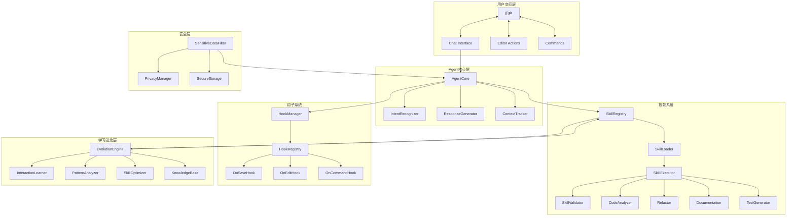
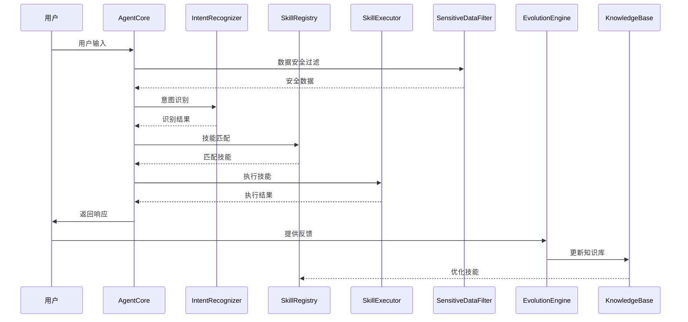

# Developer Assistant Agent

## 项目概述

这是一个基于VS Code的智能开发助手系统，通过Agent（智能体）、Skills（技能）和Hooks（钩子）构建，实现智能化的开发辅助功能。系统具备自动学习和进化能力，能够根据用户交互持续优化技能。

## 核心特性

### 1. Agent（智能体）
- 自动识别和加载：遵循VS Code扩展规范
- 上下文感知：理解当前编辑的文件、项目结构、用户操作
- 意图识别：解析用户自然语言请求
- 响应生成：根据意图调用合适的技能

### 2. Skills（技能）
- 技能注册机制：动态加载和卸载技能
- 技能进化：根据交互学习自动优化
- 技能组合：支持多个技能协同工作
- 版本管理：技能版本追踪和回滚

### 3. Hooks（钩子）
- 事件驱动：监听各种VS Code事件
- 预处理/后处理：拦截和修改操作
- 扩展点机制：提供丰富的扩展接口

### 4. 安全系统
- 敏感数据过滤：自动识别和过滤账号密码等敏感信息
- 隐私保护：确保敏感信息不泄露到大模型
- 安全存储：敏感数据加密存储

### 5. 学习进化引擎
- 交互学习：从用户反馈中学习
- 模式识别：识别常见问题和解决方案
- 技能优化：自动优化技能性能
- 知识积累：持续积累项目知识

## 目录结构

```
developer-assistant-agent/
├── src/
│   ├── agent/                    # Agent核心模块
│   │   ├── AgentCore.ts          # 智能体核心引擎
│   │   ├── AgentContext.ts       # 上下文管理
│   │   ├── AgentConfig.ts        # 配置管理
│   │   ├── IntentRecognizer.ts   # 意图识别器
│   │   └── ResponseGenerator.ts  # 响应生成器
│   │
│   ├── skills/                   # 技能系统
│   │   ├── SkillRegistry.ts      # 技能注册中心
│   │   ├── SkillLoader.ts        # 技能加载器
│   │   ├── SkillExecutor.ts      # 技能执行器
│   │   ├── SkillEvolution.ts     # 技能进化引擎
│   │   ├── SkillValidator.ts     # 技能验证器
│   │   ├── skills/               # 内置技能
│   │   │   ├── CodeAnalyzerSkill.ts
│   │   │   ├── RefactorSkill.ts
│   │   │   ├── DocumentationSkill.ts
│   │   │   └── TestGeneratorSkill.ts
│   │   └── types/                # 技能类型定义
│   │       ├── Skill.ts
│   │       ├── SkillMetadata.ts
│   │       └── SkillResult.ts
│   │
│   ├── hooks/                    # 钩子系统
│   │   ├── HookManager.ts        # 钩子管理器
│   │   ├── HookRegistry.ts      # 钩子注册表
│   │   ├── hooks/                # 内置钩子
│   │   │   ├── OnSaveHook.ts
│   │   │   ├── OnEditHook.ts
│   │   │   ├── OnCommandHook.ts
│   │   │   └── OnTerminalHook.ts
│   │   └── types/                # 钩子类型定义
│   │       ├── Hook.ts
│   │       ├── HookEvent.ts
│   │       └── HookContext.ts
│   │
│   ├── security/                # 安全系统
│   │   ├── SensitiveDataFilter.ts # 敏感数据过滤器
│   │   ├── PrivacyManager.ts     # 隐私管理器
│   │   ├── SecureStorage.ts      # 安全存储
│   │   ├── DataSanitizer.ts      # 数据清洗器
│   │   └── SecurityConfig.ts     # 安全配置
│   │
│   ├── learning/                # 学习进化系统
│   │   ├── InteractionLearner.ts # 交互学习器
│   │   ├── PatternAnalyzer.ts    # 模式分析器
│   │   ├── SkillOptimizer.ts     # 技能优化器
│   │   ├── KnowledgeBase.ts      # 知识库
│   │   ├── FeedbackCollector.ts   # 反馈收集器
│   │   └── EvolutionEngine.ts    # 进化引擎
│   │
│   ├── utils/                   # 工具模块
│   │   ├── Logger.ts             # 日志工具
│   │   ├── ConfigManager.ts      # 配置管理
│   │   └── FileSystem.ts         # 文件系统工具
│   │
│   ├── extension.ts             # VS Code扩展入口
│   └── test/                    # 测试文件
│       ├── agent.test.ts
│       ├── skills.test.ts
│       └── hooks.test.ts
│
├── resources/                   # 资源文件
│   ├── icons/                  # 图标资源
│   └── templates/              # 模板文件
│
├── .vscode/                    # VS Code配置
│   ├── launch.json             # 调试配置
│   ├── tasks.json              # 任务配置
│   └── extensions.json          # 推荐扩展
│
├── package.json                # 项目配置
├── tsconfig.json               # TypeScript配置
├── vsc-extension-quickstart.md # VS Code扩展指南
├── README.md                   # 项目说明
├── CHANGELOG.md               # 更新日志
└── LICENSE                    # 许可证
```

## 技术架构

### 架构图（Mermaid）



### 数据流图



## 安装和使用

### 前置要求
- Node.js >= 18.x
- VS Code >= 1.85.0
- TypeScript >= 5.3.0

### 安装步骤

1. 克隆项目
```bash
git clone <repository-url>
cd developer-assistant-agent
```

2. 安装依赖
```bash
npm install
```

3. 编译项目
```bash
npm run compile
```

4. 运行调试
```bash
按F5打开调试窗口
```

5. 安装扩展
```bash
code --install-extension ./dist/extension.js
```

## 配置说明

### Agent配置
在`.vscode/settings.json`中配置：
```json
{
    "developerAssistant": {
        "enabled": true,
        "model": "gpt-4",
        "maxTokens": 4000,
        "temperature": 0.7,
        "skills": {
            "autoUpdate": true,
            "learningEnabled": true
        },
        "security": {
            "filterSensitiveData": true,
            "allowedPatterns": ["*.ts", "*.js", "*.json"],
            "blockedPatterns": ["*.env", "*.key", "*password*"]
        }
    }
}
```

### 安全配置
```json
{
    "security": {
        "sensitivePatterns": [
            "password",
            "secret",
            "api_key",
            "token",
            "credential"
        ],
        "replacement": "[REDACTED]",
        "logLevel": "info"
    }
}
```

## 开发指南

### 创建自定义技能

1. 实现`Skill`接口
```typescript
import { Skill, SkillResult } from '../skills/types/Skill';

export class MyCustomSkill implements Skill {
    public readonly id: string = 'my-custom-skill';
    public readonly name: string = 'My Custom Skill';
    public readonly description: string = '描述技能功能';
    public readonly version: string = '1.0.0';

    async execute(context: SkillContext): Promise<SkillResult> {
        // 实现技能逻辑
        return {
            success: true,
            data: { /* 结果数据 */ }
        };
    }

    async validate(): Promise<boolean> {
        return true;
    }
}
```

2. 注册技能
```typescript
skillRegistry.register(new MyCustomSkill());
```

### 创建自定义钩子

1. 实现`Hook`接口
```typescript
import { Hook, HookContext } from '../hooks/types/Hook';

export class MyCustomHook implements Hook {
    public readonly event: string = 'onSave';
    public readonly priority: number = 100;

    async before(context: HookContext): Promise<void> {
        // 保存前处理
    }

    async after(context: HookContext): Promise<void> {
        // 保存后处理
    }
}
```

2. 注册钩子
```typescript
hookManager.register(new MyCustomHook());
```

## 安全说明

### 敏感数据过滤
系统自动识别并过滤以下类型的敏感信息：
- 密码和密钥
- API密钥和令牌
- 数据库连接字符串
- 私钥和证书
- 个人身份信息

### 隐私保护
- 所有敏感数据在传输前进行过滤
- 大模型仅接收脱敏后的数据
- 本地存储使用加密

## 进化机制

### 学习流程
1. 收集用户交互数据
2. 分析模式和趋势
3. 优化技能参数
4. 更新知识库
5. 验证优化效果

### 优化策略
- 基于反馈的强化学习
- 模式识别和预测
- 自适应参数调整

## 贡献指南

1. Fork项目
2. 创建特性分支
3. 提交更改
4. 创建Pull Request

## 许可证

MIT License - 详见LICENSE文件
