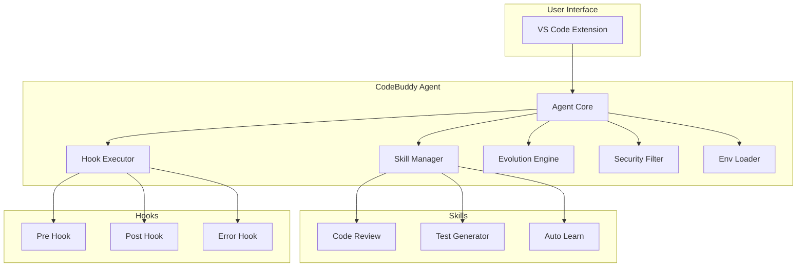

# CodeBuddy Dev Assistant Agent

一个基于 VS Code 的智能开发助手 Agent，支持 Skills（技能）、Hooks（钩子）和自动学习进化功能。

## 功能特性

### 1. Agent 核心功能
- **智能对话**: 支持自然语言交互
- **技能系统**: 可扩展的技能体系
- **钩子机制**: 生命周期事件管理
- **自动进化**: 从交互中学习和优化

### 2. Skills（技能）系统
- **代码审查 (code-review)**: 自动分析代码质量和安全问题
- **测试生成 (test-generator)**: 根据代码自动生成单元测试
- **自动学习 (auto-learn)**: 从交互中提取模式并优化

### 3. Hooks（钩子）系统
- `pre_agent_run`: Agent 执行前触发
- `post_agent_run`: Agent 执行后触发
- `on_error`: 错误发生时触发
- `pre_skill_execute`: 技能执行前触发
- `post_skill_execute`: 技能执行后触发

### 4. 安全机制
- 敏感信息过滤
- 环境变量安全加载
- 日志脱敏
- 禁止模式匹配

## 目录结构

```
.codebuddy/
├── agent/
│   └── agent.toml          # Agent 核心配置
├── skills/                  # 技能目录
│   ├── manifest.toml        # 技能注册表
│   └── skills/
│       ├── code-review/     # 代码审查技能
│       ├── test-generator/  # 测试生成技能
│       └── auto-learn/      # 自动学习技能
├── hooks/                   # 钩子目录
│   ├── hooks.toml           # 钩子配置
│   ├── security_check.py   # 安全检查钩子
│   └── conversation_logger.py
├── utils/                   # 工具模块
│   ├── env_loader.py        # 安全环境变量加载
│   ├── security_filter.py  # 安全过滤
│   ├── skill_manager.py    # 技能管理
│   ├── hook_executor.py    # 钩子执行
│   └── evolution_engine.py # 进化引擎
├── security/
│   └── security.toml        # 安全配置
├── memory/                  # 记忆存储
│   ├── conversations/        # 对话记录
│   ├── patterns/           # 学习模式
│   ├── errors/            # 错误日志
│   └── skills/            # 进化后的技能
└── config/
    └── config.toml          # 全局配置
```

## 快速开始

### 1. 安装依赖

```bash
# Windows
build.bat

# Linux/macOS
chmod +x build.sh
./build.sh
```

### 2. 配置环境变量

复制 `run-local.bat` (Windows) 或 `run-local.sh` (Unix) 为本地配置文件:

```bash
# Windows
copy run-local.bat run-local-config.bat
# 编辑 run-local-config.bat 设置你的敏感信息

# Unix
cp run-local.sh run-local-config.sh
# 编辑 run-local-config.sh 设置你的敏感信息
```

### 3. 运行 Agent

```bash
# Windows
run.bat

# Linux/macOS
chmod +x run.sh
./run.sh
```

## 配置说明

### Agent 配置 (agent.toml)

```toml
[agent]
id = "codebuddy-dev-assistant"
name = "CodeBuddy 开发助手"
version = "1.0.0"
```

### 安全配置 (security.toml)

敏感字段列表和禁止模式:

```toml
[security.sensitive_fields]
fields = ["password", "token", "api_key", ...]

[security.forbidden_patterns]
patterns = [
    "(?i)api[_-]?key\\s*[:=]\\s*['\"]?([a-zA-Z0-9_-]+)",
    ...
]
```

### 环境变量

| 变量名 | 说明 | 必需 |
|--------|------|------|
| `CODEBUDDY_API_KEY` | LLM API 密钥 | 是 |
| `CODEBUDDY_DB_PASSWORD` | 数据库密码 | 否 |
| `CODEBUDDY_SECRET_KEY` | 加密密钥 | 否 |

## 开发

### 添加新技能

1. 在 `.codebuddy/skills/skills/` 下创建目录
2. 添加 `manifest.toml` 清单文件
3. 添加 `handler.py` 处理器

示例 `manifest.toml`:

```toml
[skill]
id = "my-skill"
name = "My Custom Skill"
description = "Description of the skill"
version = "1.0.0"
enabled = true
```

示例 `handler.py`:

```python
def execute(context: dict) -> dict:
    return {
        'message': 'Skill executed successfully',
        'skill_id': 'my-skill'
    }
```

### 添加新钩子

1. 创建 Python 脚本
2. 在 `hooks/hooks.toml` 中注册

示例:

```python
def execute(context: dict) -> dict:
    # 钩子逻辑
    return {'success': True}
```

## 安全说明

### 敏感信息保护

1. **环境变量注入**: 所有密码和密钥从环境变量获取
2. **自动过滤**: 敏感信息自动从日志中移除
3. **禁止模式**: 预定义的正则表达式阻止敏感数据外泄
4. **审计日志**: 记录所有敏感操作

### 安全检查

```python
from .codebuddy.utils.security_filter import security_filter

# 过滤敏感信息
safe_text = security_filter.get_filtered_text(user_input)
```

## 架构图



## License

MIT License
